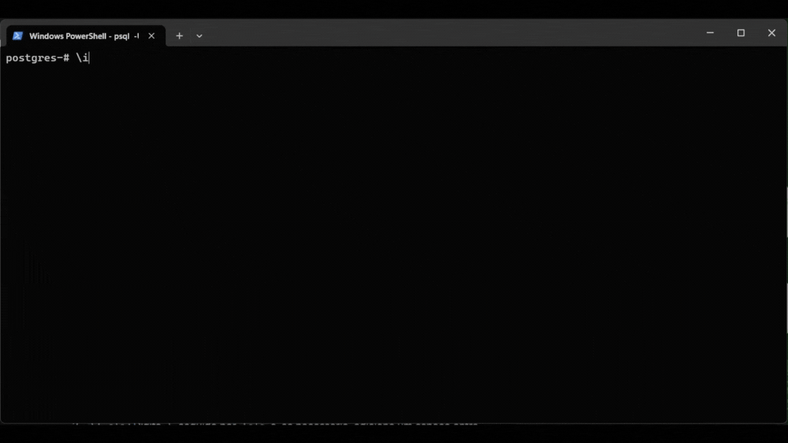

# Atividade 1 — SQL Interativo no PostgreSQL

O objetivo da atividade foi implementar pequenos programas em uma linguagem menos usual para simular entrada de usuário e resolver problemas básicos.  
No meu caso, escolhi **SQL (PostgreSQL)** utilizando o cliente `psql`.

## Enunciado

1. Peça para o programa imprimir uma mensagem de boas-vindas.  
   Depois, faça o programa pedir o nome do usuário e imprimir novamente uma frase personalizada, como:  
   `Olá, [nome]! Seja bem-vindo(a)!`

2. O programa deve pedir dois números inteiros como entrada do usuário e imprimir a soma, subtração, multiplicação e divisão entre eles.

3. Peça um número inteiro e diga se ele é:
   - Positivo, Negativo ou Zero  
   - Além disso, informe se é Par ou Ímpar

4. O programa deve pedir um número inteiro ao usuário e imprimir a tabuada desse número.  
   Mas, ao invés de só imprimir, mostre de forma formatada, por exemplo:  

```
5 x 1 = 5
5 x 2 = 10
...
```

E permita que o usuário escolha até onde vai a tabuada.

5. Peça para o usuário digitar 5 números inteiros (um por vez).  
Depois, o programa deve imprimir:
- O maior número  
- O menor número  
- A média de todos  
- A mediana  

## Como executar

1. Navegue até a pasta da Atividade 1
```bash
cd atividade_1
```

2. Abra o terminal e entre no PostgreSQL:
```bash
psql -U seu_usuario -d seu_banco
```

3. Já dentro do `psql`, rode cada questão com:
```
\i questao_1.sql
```

> Substitua pelo número da questão desejada

4. Para rodar todas de uma vez:
```
\i main.sql
```

## Exemplo de execução


